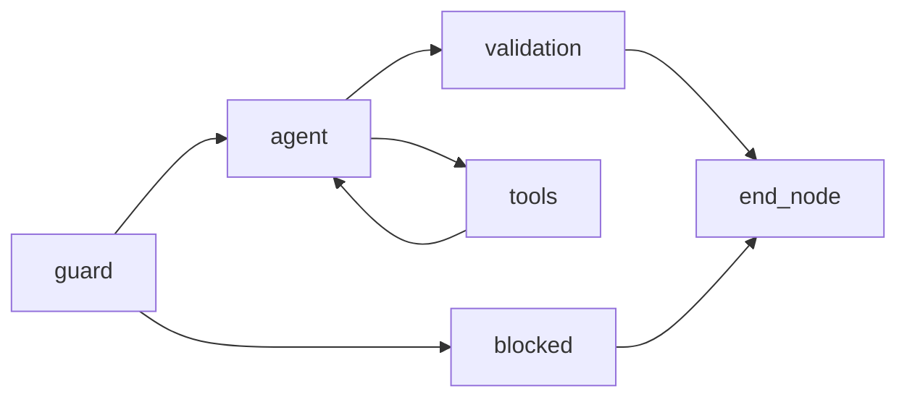

# Ecommerce AI Agent

LangGraph-powered ecommerce support agent with Streamlit UI, tool-backed catalog/orders/returns, guardrails, and optional Langfuse tracing.

**Full design notes:** [docs/PROJECT.md](docs/PROJECT.md) — LLM provider abstraction, rate-limit handling, three-layer security, LangGraph flow, tests, and Langfuse.

## Highlights

- **LLM-agnostic** — OpenAI or Gemini via `LLM_PROVIDER`; graceful user messages on rate limits and quota errors
- **Three-layer security** — prompt-injection guard, tool-grounded facts + validation against policy, safe tool execution
- **LangGraph** — guard → agent ↔ tools → validation graph in `app/graph.py`
- **Testable** — pytest unit tests and JSON eval cases under `tests/`
- **Observability** — optional Langfuse spans per node and LLM generation

## Project structure

```
app/
├── main.py              # Streamlit UI
├── graph.py             # LangGraph orchestration
├── state.py             # Agent state schema
├── config.py            # Settings from .env
├── nodes/               # guard, agent, tools, validation
├── tools/               # catalog, orders, returns
├── prompts/             # system + classifier prompts
├── data/                # products.json, orders.json
├── observability/       # Langfuse client
└── utils/               # logging

tests/                   # pytest + eval runner
docs/
└── PROJECT.md           # architecture and design rationale
```

## Quick start

```bash
python -m venv .venv
.venv\Scripts\activate   # Windows
pip install -r requirements.txt
```

Copy `.env.example` to `.env` and set keys for your provider (`OPENAI_API_KEY` or `GOOGLE_API_KEY`).

```bash
# Run UI
streamlit run app/main.py

# Run tests
pytest tests/ -v

# Run eval cases
python tests/run_eval.py
```

## Docker (optional)

```bash
docker compose up --build
```

Open http://localhost:8501

## Configuration

| Variable | Description |
|----------|-------------|
| `LLM_PROVIDER` | `openai` (default) or `gemini` |
| `OPENAI_API_KEY` | Required when `LLM_PROVIDER=openai` |
| `OPENAI_MODEL` | Default `gpt-4o-mini` |
| `GOOGLE_API_KEY` | Required when `LLM_PROVIDER=gemini` (alias: `GEMINI_API_KEY`) |
| `GEMINI_MODEL` | Default `gemini-2.0-flash` |
| `RETURN_WINDOW_DAYS` | Return policy window (default 30) |
| `MAX_INJECTION_SCORE` | Guard threshold 0–1 |
| `LANGFUSE_*` | Optional tracing |

## Agent flow


