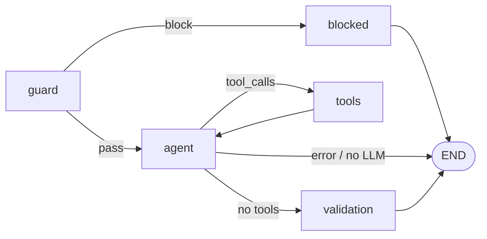
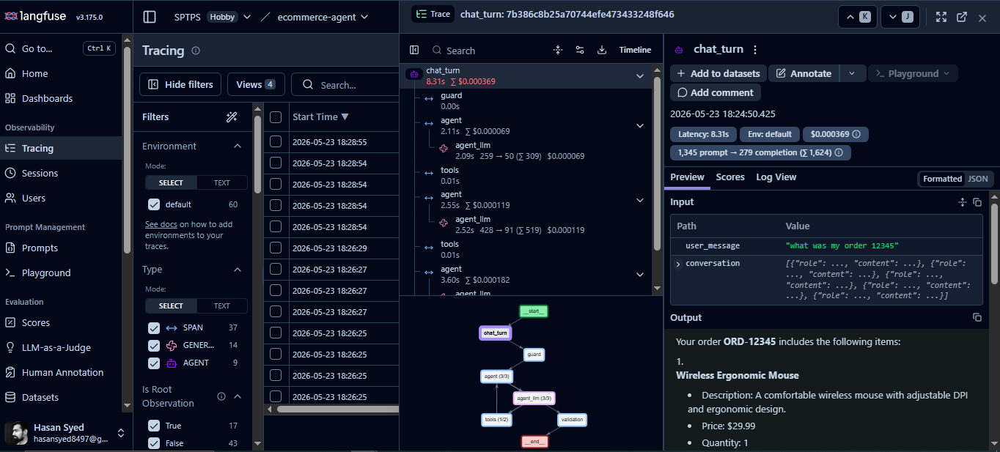

# Ecommerce AI Agent — Project Overview

This project is a **production-style reference implementation** of an ecommerce customer-support agent. It combines a **LangGraph** orchestration layer, **tool-backed** catalog/order/return APIs, **three layers of safety**, **provider-agnostic LLM** integration, **pytest** coverage, and optional **Langfuse** observability.

## What the agent does

Customers interact through a **Streamlit** chat UI. The agent can:

- Search the product catalog and look up products by ID
- Look up order status and list orders by customer
- Check return eligibility and create return requests

Factual data lives in JSON fixtures under `app/data/` (`products.json`, `orders.json`). The LLM is instructed to use tools for facts rather than inventing IDs, prices, or stock levels.

## Architecture (LangGraph)

Orchestration is defined in `app/graph.py` as a **StateGraph** over `AgentState`:



| Node | Role |
|------|------|
| **guard** | Input safety — prompt-injection heuristics |
| **agent** | LLM reasoning and tool-call planning |
| **tools** | Executes catalog, order, and return tools |
| **validation** | Post-tool business-rule checks (anti-hallucination for returns) |
| **blocked** | User-facing message when guard rejects input |

Each node is a plain Python function, which keeps the graph **testable** without starting the UI or calling a live LLM when tests mock the model layer.

## 1. LLM-agnostic design and graceful limit handling

**Provider switching** is centralized in `app/utils/llm_factory.py`. Set `LLM_PROVIDER` to `openai` or `gemini` in `.env`; the factory builds the correct LangChain chat model and binds the same tool set for both.

**Graceful degradation** when limits or outages occur:

- `app/utils/llm_errors.py` classifies provider exceptions (HTTP 429, `RateLimitError`, quota/billing messages, etc.) across exception chains.
- `app/nodes/agent_node.py` catches LLM failures, logs them with provider context, and returns a **friendly `AIMessage`** instead of crashing the graph or Streamlit session.
- Users see distinct messages for **rate limit**, **quota exceeded**, and **generic** failures.

Unit tests cover this behavior (`tests/test_llm_errors.py`, `tests/test_agent_rate_limit.py`).

## 2. Three-layer security

Security is applied in **depth** — input, model behavior, and output:

### Layer 1 — Prompt injection (`guard` node)

`app/nodes/guard_node.py` scores the latest human message with regex heuristics (jailbreak phrases, “ignore previous instructions”, script tags, etc.). If the score meets `MAX_INJECTION_SCORE` (default `0.5`), the graph routes to **blocked** and never calls the LLM.

### Layer 2 — Hallucination mitigation (`agent` + tools + `validation`)

- **System prompt** (`app/prompts/system_prompt.py`) requires tool use for factual data and forbids inventing order IDs or prices.
- **Tool grounding**: the agent must call tools to read catalog and orders from JSON sources.
- **Validation node** (`app/nodes/validation_node.py`) re-evaluates return-related tool outputs against `evaluate_return_policy()` and order records. If the model or a tool result claims eligibility that contradicts policy, the user gets a policy violation message instead of a false approval.

### Layer 3 — Tool validation (`tools` node)

`app/nodes/tool_node.py`:

- Rejects unknown tool names with a structured JSON error
- Wraps tool execution in try/except so failures become tool messages the agent can recover from
- Accumulates `tool_results` for the validation layer

Together, these layers address **untrusted input**, **ungrounded claims**, and **unsafe or inconsistent tool outcomes**.

## 3. Testable codebase

The project is structured for **unit and integration tests** without a live API key:

| Area | Example tests |
|------|----------------|
| Guardrails | `tests/test_guardrails.py` |
| Tools / policy | `tests/test_tools.py`, `tests/test_returns_policy.py` |
| LLM factory & errors | `tests/test_llm_factory.py`, `tests/test_llm_errors.py` |
| Agent / graph | `tests/test_agent_flows.py`, `tests/test_agent_rate_limit.py` |
| Langfuse helpers | `tests/test_langfuse_client.py` |

Run:

```bash
pytest tests/ -v
```

**Eval cases** (`tests/eval_cases.json`, runner `tests/run_eval.py`) provide scenario-based checks (catalog search, order lookup, return policy, injection block). These are useful for regression when changing prompts or graph routing.

## 4. Langfuse observability

When `LANGFUSE_PUBLIC_KEY` and `LANGFUSE_SECRET_KEY` are set, `app/observability/langfuse_client.py` provides:

- **`@traced_node`** — spans per graph node (guard, agent, tools, validation, blocked)
- **`trace_llm_generation`** — records model name, serialized messages, and completion output for agent turns
- **No-op behavior** when keys are missing, so local dev and CI work without Langfuse

Traces help debug tool selection, latency, and guard/validation outcomes in production-like environments.



## Configuration reference

See [README.md](../README.md) for environment variables and quick start. Copy `.env.example` to `.env` and never commit `.env` (it is listed in `.gitignore`).

## Related files

| Path | Purpose |
|------|---------|
| `app/graph.py` | LangGraph definition |
| `app/main.py` | Streamlit UI |
| `app/config.py` | Pydantic settings from `.env` |
| `app/tools/` | LangChain tools + `TOOL_MAP` |
| `app/observability/langfuse_client.py` | Tracing integration |
